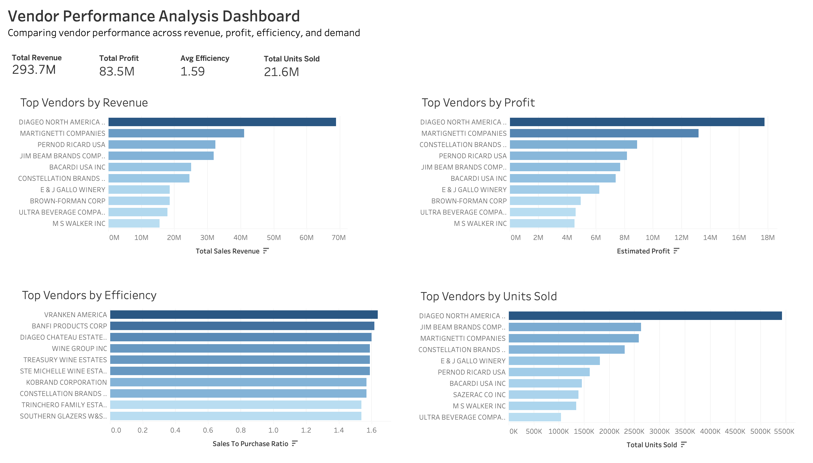

# Vendor Performance Analysis

## Dashboard Preview

## Business Problem

Retail companies often work with many vendors to supply products, but not all vendors contribute equally to business performance. Some vendors generate high revenue, others provide stronger profit margins, while some may drive large sales volumes with lower efficiency.

Because of this, procurement and operations teams need a data-driven way to evaluate vendor performance and identify which suppliers truly add value to the business.

In this project, I analyze purchasing and sales data to evaluate vendor performance across four key areas:

1. Total revenue generated
2. Estimated profit contribution
3. Sales-to-purchase efficiency
4. Total units sold

The goal of this analysis is to answer questions such as:

- Which vendors generate the most revenue for the company?
- Which vendors contribute the most profit?
- Which vendors provide the highest return relative to purchasing costs?
- Are high-volume vendors also the most profitable?
- Is the business overly dependent on a small number of vendors?

To answer these questions, I combined purchasing and sales datasets using SQL, performed additional analysis in Python, and built an interactive Tableau dashboard to compare vendor performance across revenue, profit, efficiency, and demand.

This analysis demonstrates how data-driven vendor evaluation can help procurement teams identify high-performing vendors, flag underperforming suppliers, and support more informed sourcing decisions.

## Key Insights
- **Revenue is concentrated among a few vendors**  
DIAGEO NORTH AMERICA generates significantly more revenue than other vendors, followed by MARTIGNETTI COMPANIES and PERNOD RICARD USA. This suggests the business relies heavily on a small group of suppliers.

- **Top revenue vendors also drive most profit**  
The vendors leading in revenue also appear among the top profit contributors. This indicates that high-volume vendors are also financially valuable.

- **High efficiency vendors differ from revenue leaders**  
Vendors with the highest sales-to-purchase ratios do not appear in the top revenue rankings. This suggests smaller vendors may generate stronger returns relative to purchasing costs.

- **High demand does not always mean high profit**  
Some vendors rank highly in total units sold but do not appear among the top profit contributors, indicating lower margins despite strong demand.

- **Vendor performance varies across metrics**  
No single vendor dominates across revenue, profit, efficiency, and units sold, highlighting the importance of evaluating vendors using multiple measures.

## Business Recommendations

- **Prioritize high-performing vendors**  
Focus procurement decisions on top performers such as DIAGEO NORTH AMERICA and MARTIGNETTI COMPANIES, which rank highly in both revenue and profit.

- **Expand relationships with high-efficiency vendors**  
Vendors with strong sales-to-purchase ratios generate higher returns per dollar spent. Increasing orders from these suppliers could improve overall profitability.

- **Review high-volume, low-margin vendors**  
Some vendors show high units sold but lower profit contribution. These vendors should be evaluated for pricing adjustments or cost reductions.

- **Diversify vendor dependency**  
Revenue is concentrated among a small number of vendors. Expanding mid-tier vendors could reduce risk and improve supply chain stability.

- **Use multiple metrics for vendor evaluation**  
Procurement decisions should consider revenue, profit, efficiency, and demand together rather than relying on a single metric.